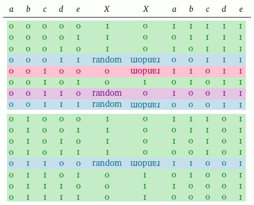
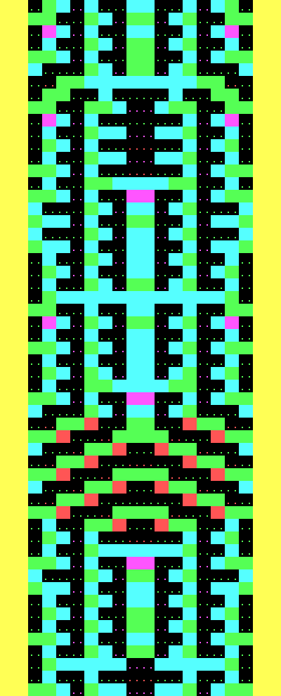

# entombed (original readme)
Code for the paper [Entombed: An archaeological examination of an Atari 2600 game](https://doi.org/10.22152/programming-journal.org/2019/3/4) by John Aycock and Tara Copplestone.

# additions
Messed around with the code to add coloured (ANSI) output, highlighting tiles where the values from the generation table aren't symmetrical to the inverse values.

I have also stuck random to always be 1 in order to highlight the impact of those tiles on the level's navigability better (worst-case scenario)

I don't know if any conclusions can be drawn from this. Maybe the table originally was completely symmetrical, and then those two special cases were picked to significantly increase a path's chance of continuation?
